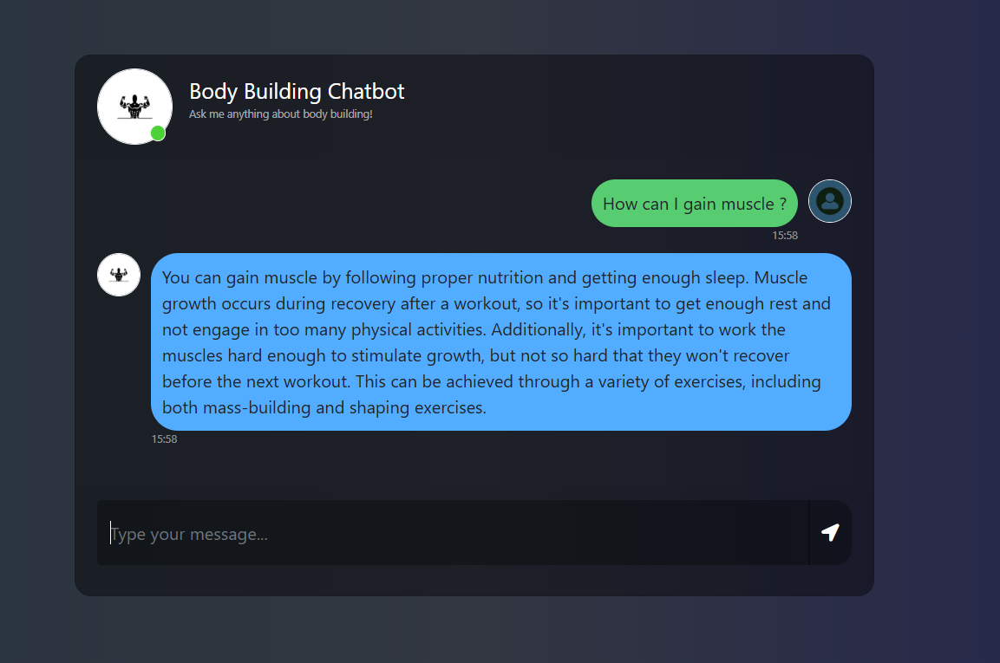

# BodyScienceLLM



### Techology and Tools used
- Python (version 3.9)
- Lang Chain 
- Hugging Face Embedding Model 
- PineCone
- OpenAI 
- Flask

### Running the application

- Clone the repository
```
git clone https://github.com/tarang1998/bodyScienceLLM.git
```
- Create and activate the conda environment

```
conda create -n bodyScience python=3.10 -y
conda activate bodyScience
```

- Install the requirements 
```
pip install -r requirements.txt
```

- Add the OPENAI_API_KEY and PINECONE_API_KEY in the .env file 

- Save the vector embeddings to Pinecone
```
python store_index.py
```

- Run the flask application
```
python app.py
```

